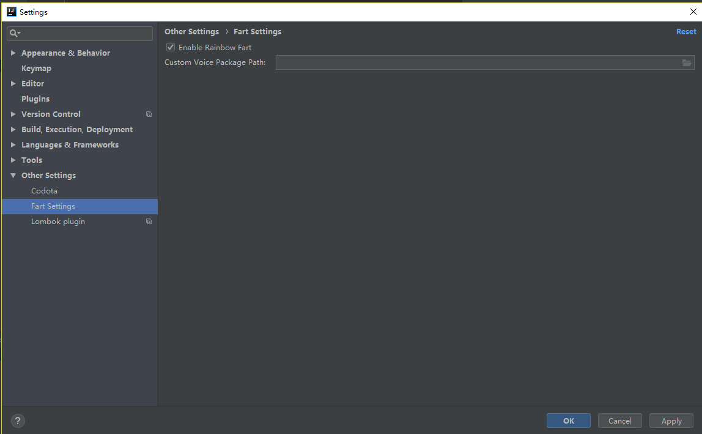
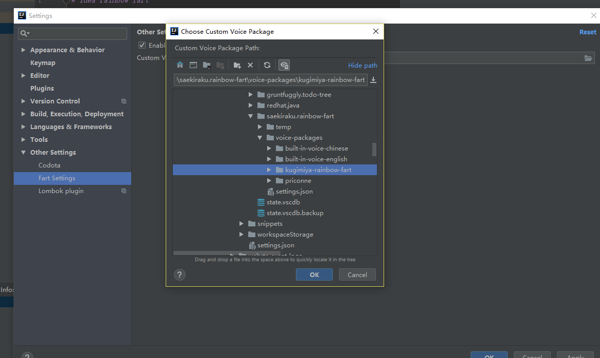
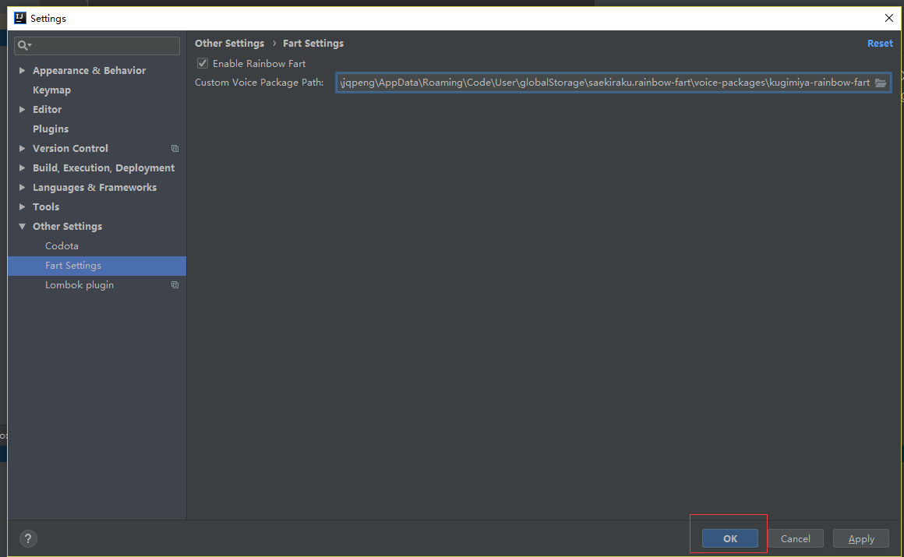

# idea-rainbow-fart
一个在你编程时疯狂称赞你的 IDEA扩展插件,兼容VSCode版本语音包 | An IDEA extension that keeps giving you compliment while you are coding, it will checks…

## 缘起

是否听说过程序员鼓励师，不久前出了一款vscode的插件rainbow-fart，可以在写代码的时候，匹配到特定关键词就疯狂的拍你马屁。

vscode的下载尝试过，但是作为日常将IDEA作为主力生产工具的同学来说，如何体验呢? 于是假期花了一点时间，写了一个idea版本的插件[idea-rainbow-fart](https://github.com/jadepeng/idea-rainbow-fart)。

## 使用说明

默认使用中文语音包，可以在setting里设置

打开设置：

选择第三方语音包：

可以到 [https://github.com/topics/vscode-rainbow-fart](https://github.com/topics/vscode-rainbow-fart) 查找语音包。

点击确定生效：

## 参考

- 插件参考,感谢原作者的贡献
    - https://github.com/izhangzhihao/intellij-rainbow-fart
    - https://github.com/SaekiRaku/vscode-rainbow-fart