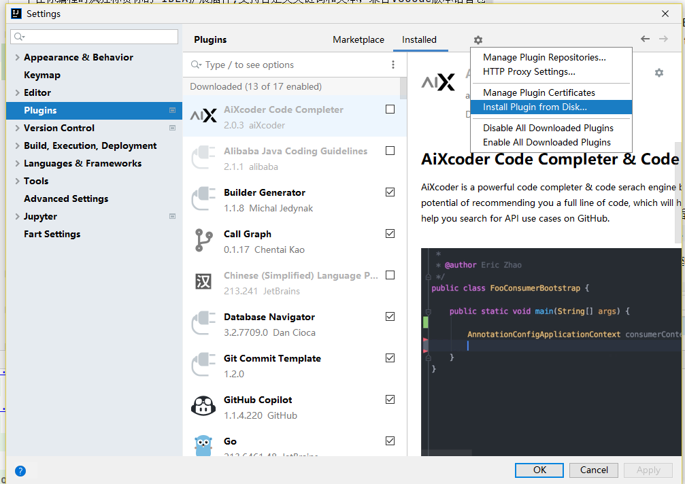
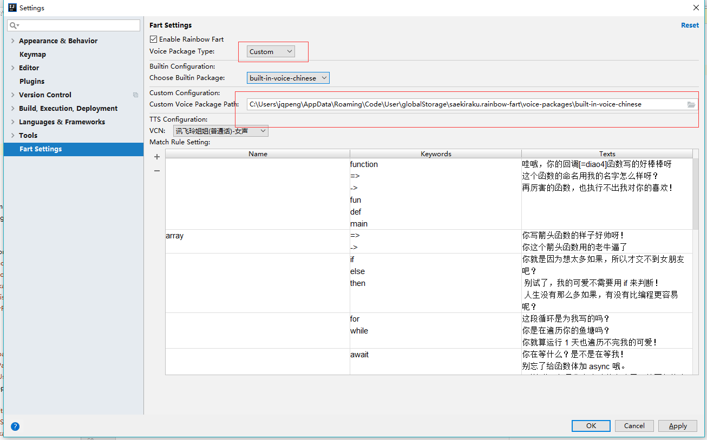
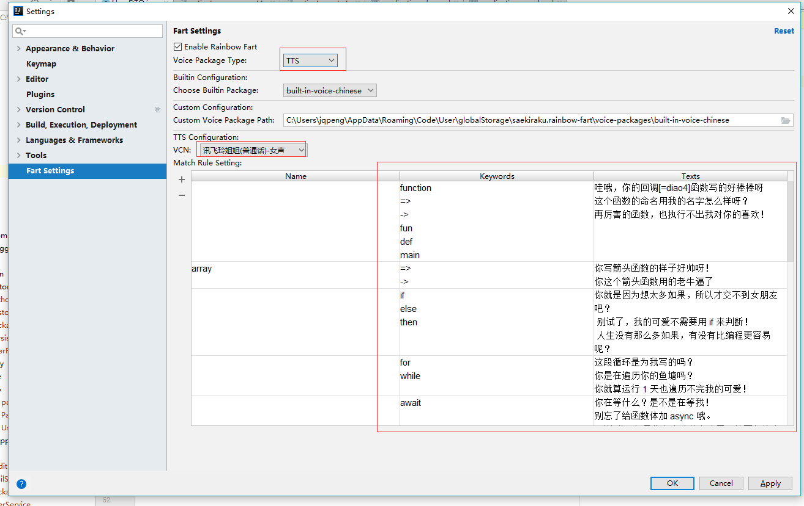

# idea-rainbow-fart

一个在你编程时疯狂称赞你的 IDEA扩展插件,支持自定义关键词和文本，兼容VSCode版本语音包 | An IDEA extension that keeps giving you compliment while you are coding, it will checks…

## 安装方法

到[releases](https://github.com/jadepeng/idea-rainbow-fart/releases) 下载最新的插件。

下载最新Release

### 通过Setting - plugins - Install plugins from disk 安装

然后选择下载的插件zip包即可。

### 手动安装

打开Idea的插件目录，比如笔者的目录是`C:\Program Files\JetBrains\IntelliJ IDEA 2018.2.4\plugins`

将`rainbow-fart-1.x.zip`解压到plugins目录，如图所示：

然后重启IDEA即可。

## 使用说明

### 使用内置语音包

打开设置：

- 将voice package type设置为builtin
- 可以选择内置语音包，共三个，一个官方的中文和英文，一个tts合成的（志玲姐姐）

### 使用第三方语音包：

- 将voice package type设置为custom
- 可以到 [https://github.com/topics/vscode-rainbow-fart](https://github.com/topics/vscode-rainbow-fart) 查找语音包。

点击确定生效。

### 使用TTS（推荐）

本插件特色功能，支持自定义关键词和文本，鼠标点击表格可以修改关键词和回复语，修改时enter回车换行，一行代表一个

TTS 使用科大讯飞提供的流式API。

## 鸣谢

- 插件开发参考 https://github.com/izhangzhihao/intellij-rainbow-fart
- 语音包引用自 https://github.com/SaekiRaku/vscode-rainbow-fart
    